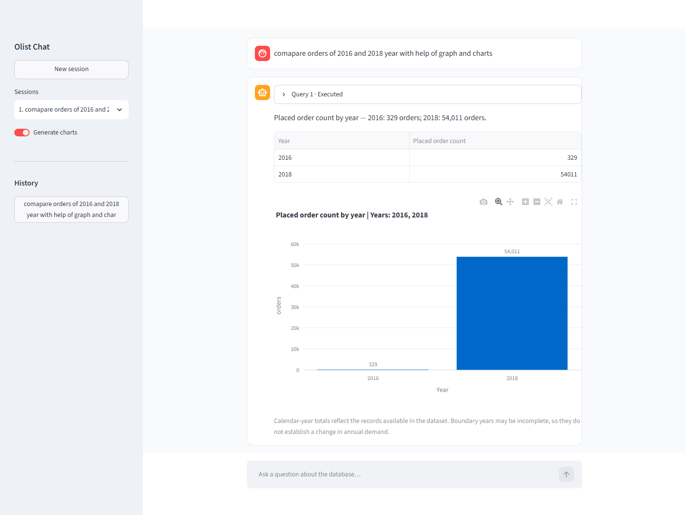
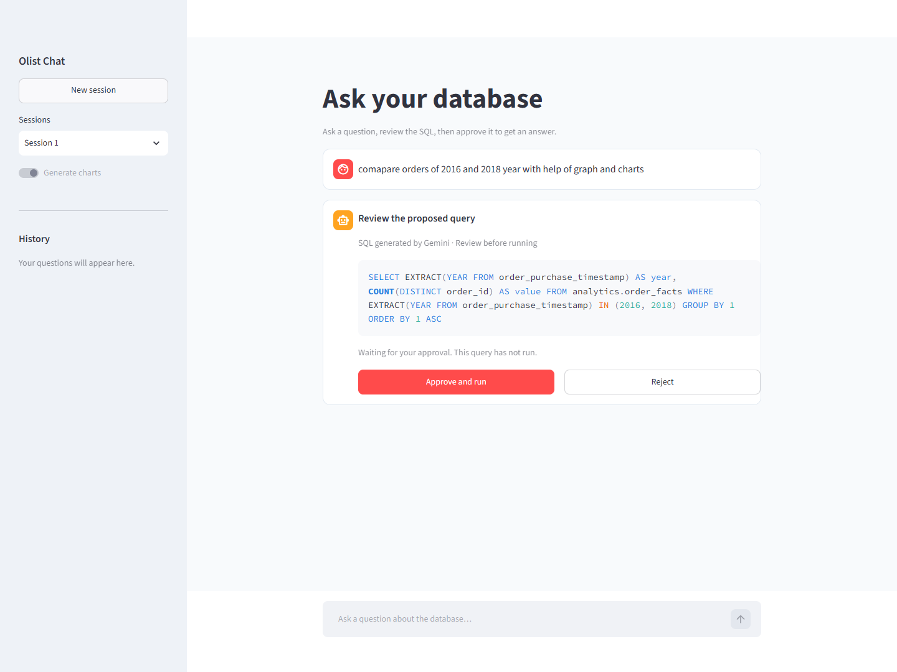
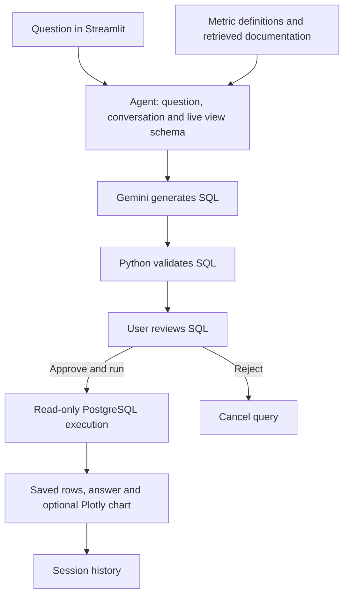

# DatabaseRAG

Ask questions about a PostgreSQL database in plain English, review the SQL generated by Gemini, and approve it to see results and charts.

Built with **Python, Streamlit, Gemini, LangChain, PostgreSQL, pgvector, and Plotly**, using the historical Olist Brazilian e-commerce dataset.

## Demo

[▶ Watch the demo in your browser — no download required](https://drive.google.com/file/d/1HQmMSei_0-pIQt3-Z5DvPb0ZXdk1iOqH/view)

Click either screenshot to open the video. A [downloadable copy](https://github.com/amansingh425442/DatabaseRAG/releases/tag/v0.1.0) is also available on GitHub.

[](https://drive.google.com/file/d/1HQmMSei_0-pIQt3-Z5DvPb0ZXdk1iOqH/view)

## Features

- Gemini generates complete SQL from natural-language questions and relevant database schema.
- Review SQL and click **Approve and run** or **Reject**. Every new analytics query requires approval.
- Turn **Generate charts** on or off; supported results produce bar, line, grouped bar, pie, or scatter charts.
- Create sessions, switch conversations, and revisit answers and executed SQL in history.
- Retrieve documentation and metric definitions using local embeddings and pgvector.
- Validate queries and execute with read-only access, timeouts, and result limits.

[▶ Watch the demo in your browser — no download required](https://drive.google.com/file/d/1HQmMSei_0-pIQt3-Z5DvPb0ZXdk1iOqH/view)

[](https://drive.google.com/file/d/1HQmMSei_0-pIQt3-Z5DvPb0ZXdk1iOqH/view)

## Architecture



Gemini receives the question, recent conversation, approved-view columns and types, relationships, metric definitions, and retrieved context when needed. **Gemini generates SQL; Python validates and executes the approved SQL without replacing it with a query template.** Retrieval indexes documentation; PostgreSQL calculates actual totals.

The database and embeddings run locally. Questions, selected context, and tool results can be sent to the configured Gemini API. Use your own key; provider quotas apply.

The agent exposes five tools: `retrieve_context`, `validate_sql`, `execute_analytics_query`, `check_result`, and `create_chart`. Schema and metric definitions are supplied in the initial prompt, so separate tools to return them are unnecessary.

## Quick start

Requirements: Python 3.11 or 3.12, Git, a Gemini API key, and Docker with Docker Compose. Initial data and embedding downloads need internet access. Run commands from the repository root.

### 1. Install

```powershell
git clone https://github.com/amansingh425442/DatabaseRAG.git
cd DatabaseRAG
python -m venv .venv
.\.venv\Scripts\Activate.ps1
python -m pip install -e ".[test,gemini]"
```

On macOS/Linux, activate with `source .venv/bin/activate`. Conda users can instead run `conda env create -f environment.yml`, then `conda activate commerce-agent`.

### 2. Configure PostgreSQL and Gemini

```powershell
python scripts/configure_local.py
```

This creates an ignored `.env` with generated local database credentials. Open `.env` in your editor and add:

```dotenv
GOOGLE_API_KEY=your_own_api_key
```

Then run:

```powershell
python scripts/configure_gemini.py
docker compose up -d --wait
python -m olist_agent.cli init-db
```

The default model is `gemini-3.1-flash-lite`. Select another available model with `python scripts/configure_gemini.py --model MODEL_ID`. See [.env.example](.env.example) for configuration names and [Google AI Studio](https://aistudio.google.com/) for your own key. Never commit `.env`.

### 3. Download, import and index

```powershell
python scripts/download_olist.py
python -m olist_agent.cli import data/raw
python scripts/verify_import.py
python -m olist_agent.cli index
```

The downloader retrieves the original public [Olist dataset from Kaggle](https://www.kaggle.com/datasets/olistbr/brazilian-ecommerce) and validates nine CSV headers. If unavailable, download from Kaggle manually and extract the nine CSVs into `data/raw/`, then import. Dataset files and database storage are excluded from Git. The first indexing run downloads `sentence-transformers/all-MiniLM-L6-v2`; only documentation is embedded.

### 4. Start the app

```powershell
python -m streamlit run ui/app.py --server.address 127.0.0.1
```

Open **http://127.0.0.1:8501**, ask a question, review SQL, and approve it. Enable **Generate charts** for a graph.

For later runs, activate your environment, start PostgreSQL with `docker compose up -d --wait`, and run Streamlit again.

### Windows without Docker

The native PostgreSQL helper requires Visual Studio C++ build tools for a fresh pgvector build. After configuring `.env`, run:

```powershell
powershell -NoProfile -ExecutionPolicy Bypass -File scripts/local_postgres.ps1 -Action Setup
```

Then follow initialization, import, indexing, and Streamlit steps above. For an existing native installation:

```powershell
powershell -NoProfile -ExecutionPolicy Bypass -File scripts/local_postgres.ps1 -Action Start
python -m streamlit run ui/app.py --server.address 127.0.0.1
```

Use `-Action Stop` to stop the native server. Use either Docker or the native server on port 55432. See [Local setup](docs/LOCAL_SETUP.md) and [Database access](docs/DATABASE_ACCESS.md).

## Example questions

- Compare orders in 2016 and 2018 and draw a bar chart.
- Show monthly delivered orders during 2017 as a line chart.
- Compare the top 10 product categories by item sales with a bar chart.
- Compare average delivery time across customer states for delivered orders.
- Show payment value by payment type as a pie chart.

On the original dataset, the first example returns **329 orders in 2016** and **54,011 in 2018**. Boundary years are partially covered, so these are available-record counts rather than complete annual demand.

## Data and safeguards

Nine source tables cover orders, customers, items, payments, reviews, products, sellers, geolocation, and category translations. The agent queries curated views: `analytics.order_facts`, `analytics.category_items`, and `analytics.payment_records`.

Validation allows one read-only SELECT with supported joins, CTEs, subqueries, and analytical functions. Unsupported relations, unknown columns, writes, and multiple statements are rejected. Approval is tied to the exact query and session. Timeouts, row limits, and payload limits bound execution; truncated results are identified.

Conversations and results persist in PostgreSQL. Session selection and pending approvals belong to the current browser session; reloads or restarts can lose access to in-memory session capabilities. This is a local app; authenticated multi-user hosting is outside its current scope.

## Project layout

```text
ui/app.py                   Streamlit chat and SQL approval
src/olist_agent/agent/      Gemini adapter and orchestration
src/olist_agent/analytics/  SQL validation, schema and presentation
src/olist_agent/retrieval/  Documentation indexing and retrieval
src/olist_agent/db/         Schema, roles and analytics views
src/olist_agent/ingestion/  CSV validation and import
src/olist_agent/charts/     Plotly rendering
scripts/                    Setup and verification helpers
tests/                      Unit, UI, integration and live tests
docs/                       Setup, architecture and verification
```

## Tests and documentation

```powershell
python -m pytest -q -m "not integration and not live"
```

Offline tests exercise SQL validation, approvals, charts, fixture calculations, and Streamlit. PostgreSQL integration and Gemini live tests require explicit configuration; see [Local setup](docs/LOCAL_SETUP.md).

- [Architecture and metric decisions](docs/DECISIONS.md)
- [Verification records](docs/VERIFICATION.md)
- [Detailed local setup](docs/LOCAL_SETUP.md)
- [Read-only database access](docs/DATABASE_ACCESS.md)
- [Original project handoff](docs/HANDOFF.md)

API keys, credentials, raw source CSVs, environments, logs, and PostgreSQL storage are excluded. The recording is a release attachment.
